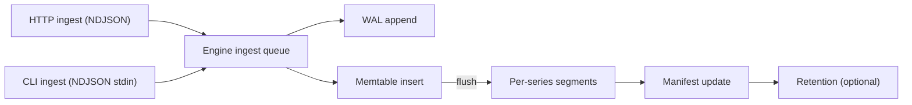
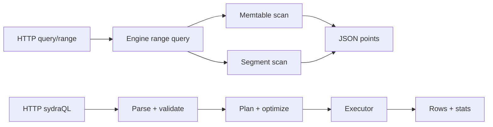

# Architecture overview

This page provides a high-level map of SydraDB’s runtime surfaces and where they live in the source tree.

## Entry points and surfaces

- **Process entry**: [`src/main.zig`](../reference/source/entrypoints/src-main.md) → [`src/sydra/server.zig`](../reference/source/sydra/server.md)
- **HTTP server**: [`src/sydra/http.zig`](../reference/source/sydra/http.md)
- **Core engine**: [`src/sydra/engine.zig`](../reference/source/sydra/engine.md)
- **PostgreSQL compatibility (pgwire)**: [`src/sydra/compat/`](../reference/source/sydra/compat/overview.md) (invoked via [`sydradb pgwire`](../reference/cli.md#pgwire-address-port))
- **sydraQL**: [`src/sydra/query/`](../reference/source/sydra/query/overview.md) (invoked via [`POST /api/v1/sydraql`](../reference/http-api.md#post-apiv1sydraql))

## Ingest and storage flow (high level)

1. Requests arrive via:
   - HTTP [`POST /api/v1/ingest`](../reference/http-api.md#post-apiv1ingest) (NDJSON), or
   - CLI [`sydradb ingest`](../reference/cli.md#ingest) (NDJSON via stdin)
2. The engine enqueues ingest items.
3. A writer loop:
   - Appends to WAL
   - Inserts into the in-memory memtable
4. When flush conditions hit (time-based or size-based), the engine:
   - Writes per-series segments
   - Updates the manifest
   - Applies retention (best-effort, if enabled)

See also:

- [On-disk structures](../reference/on-disk-format.md)

## Query flow (high level)

- **Range query**:
  - HTTP [`POST /api/v1/query/range`](../reference/http-api.md#post-apiv1queryrange) or [`GET /api/v1/query/range`](../reference/http-api.md#get-apiv1queryrange)
  - Delegates to the engine range-query path and returns a JSON array of points.
- **sydraQL**:
  - HTTP [`POST /api/v1/sydraql`](../reference/http-api.md#post-apiv1sydraql) executes a query pipeline and returns columns, rows, and execution stats.
  - Design details: [sydraQL Design](../concepts/sydraql-design.md)
  - Implementation notes (supplementary): [sydraDB Architecture & Engineering Design (Supplementary, Oct 18 2025)](./supplementary-design-2025-10-18.md)

