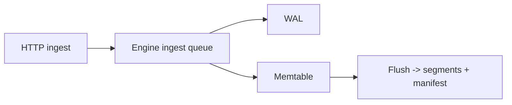

# Docusaurus toolbox (site improvements)

This page is a practical checklist of Docusaurus “batteries included” features we can use to keep SydraDB docs navigable, searchable, and easy to maintain.

## Navigation & information architecture

- **Categories**: use `_category_.json` to label and order sections, and to add category landing pages.
- **Autogenerated sidebars**: for “Source Reference”, prefer `type: "autogenerated"` (already used) so new files don’t require sidebar edits.
- **Doc pagination**: keep pages small and ensure they have clear “Next” paths; use sidebar ordering to control next/prev.
- **Category landing pages** (optional): convert `index.md` pages to MDX and render a card list:

```mdx
import DocCardList from "@theme/DocCardList";

<DocCardList />
```

## Authoring primitives (use everywhere)

### Admonitions (callouts)

Use these to surface “sharp edges” and invariants:

```md
:::warning
The config loader is not full TOML. Inline comments after values are not reliably supported.
:::
```

### Collapsible details

Great for long excerpts or edge-case notes:

```md
<details>
<summary>Why tags affect series identity</summary>

See `types.seriesIdFrom(series, tags_json)` in `src/sydra/types.zig`.
</details>
```

### Code blocks with titles and line highlighting

Use titles so readers know where a snippet comes from:

````md
```zig title="src/sydra/http.zig (excerpt)" {1,4-9}
// ...
```
````

### Tabs (MDX)

Useful for pairing HTTP vs CLI examples:

````mdx
import Tabs from "@theme/Tabs";
import TabItem from "@theme/TabItem";

<Tabs>
  <TabItem value="http" label="HTTP">
    ```sh
    curl -XPOST localhost:8080/api/v1/ingest --data-binary $'{"series":"cpu","ts":1,"value":1.0}\n'
    ```
  </TabItem>
  <TabItem value="cli" label="CLI">
    ```sh
    echo '{"series":"cpu","ts":1,"value":1.0}' | ./zig-out/bin/sydradb ingest
    ```
  </TabItem>
</Tabs>
````

### Stable deep links (headings + anchors)

- Prefer linking to **doc headings** (`.../http-api.md#post-apiv1ingest`) rather than freeform text references.
- For “line-level” references, create a dedicated heading near the excerpt (or a tiny anchor) and link to that heading. Docusaurus does not provide stable per-line anchors inside code blocks by default.

## Search & metadata

- **Local search**: the site uses `@easyops-cn/docusaurus-search-local` (already configured). Headings and concise first paragraphs improve search ranking.
- **Doc tags** (optional): add frontmatter tags on key pages to get a tag index under `/docs/tags`:

```yaml
---
tags:
  - http
  - api
---
```

## Git integrations (quality-of-life)

These are Docusaurus-native options that improve maintainer workflow:

- **Edit this page** links (GitHub)
- **Last updated** time/author metadata

These require configuration in `docs/docusaurus.config.js` (no content changes needed).

## Diagrams (Mermaid enabled)

Docusaurus renders Mermaid diagrams (via `@docusaurus/theme-mermaid`), so we can keep architecture diagrams as source-controlled text:

````md

````

## Suggested next improvements (incremental)

- Add doc tags for the main “Start Here” + “Reference” pages and add a navbar link to `/docs/tags`.
- Convert a few index pages to show card lists (`DocCardList`) for faster discovery.
- Add a small set of Mermaid diagrams for ingest/query flows and pgwire.
- Add a “Doc style guide” section (short) so new pages follow consistent headings: Purpose / See also / Definition index / Ownership / Errors.
